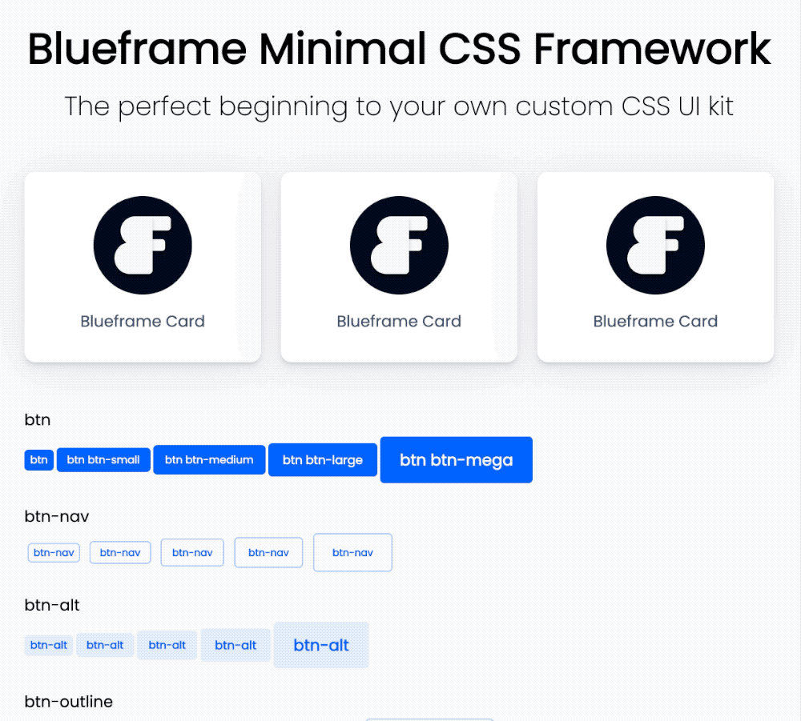

##### Created by [Titus Decali](https://www.TitusDecali.com)

# Blueframe - SCSS Front-end Framework

Blueframe is an ultra light-weight SCSS framework. It's great for building smaller projects, or as a base to begin creating your own custom framework. It uses short, easy to remember utility classes. Class names have been adopted from the best css frameworks including Skeleton and Bootstrap (minus the weight), while adding a few new ones for convenience and faster typing. It includes CSS resets (Normalize CSS) to ensure your designs start from the same point on every browser. It does not require any addition dependancies or script imports.



You can set up all spacing variables, colors and other default settings via the `base/_variables.scss` file. For project-specific classes, you can add to the `/project/project.scss` file. This lets you continue building a custom framework that can grow with you, while separating project-specific classes.

Check the `/base/utility.scss` file to see how you can quickly add utility classes to your HTML.

**Base Utility Classes**

All padding and margins go up to 5 (EX: px-5, mr-5)

Padding can be added as follows:

```
pr-1 = padding-right: $p1
pl-1 = padding-left: $p1
px-1 = padding for horizontal right/left: $p1
py-1 = padding for vertical top/bottom: $p1
pt-1 = padding-top: $p1
pb-1 = padding-bottom: $p1
```

Setting margins works the same way:

```
mx-auto = margin-right: auto, margin-left: auto;
mr-1 = margin-right: $m1
ml-1 = margin-left: $m1
mx-1 = margin for horizontal right/left: $m1
my-1 = margin for vertical top/bottom: $m1
mt-1 = margin-top: $m1
mb-1 = margin-bottom: $m1
```

**EX:**

```
<div class="mx-auto"></div>
```

**Positioning Classes:**

```
absolute = position: absolute;
relative = position: relative;
```

**Display Classes:**

```
block = display: block;
inline = display: inline;
inline-block = display: inline-block;
```

**Overflow Classes:**

```
o-h = overflow: hidden;
ox-h = overflow-x: hidden;
oy-h = overflow-y: hidden;
```

**View Width/Height, Float Classes:**

```
.w-100 {
  width: 100%;
  box-sizing: border-box;
}

.h-100 {
  height: 100%;
  box-sizing: border-box;
}

.float-right {
  float: right;
}

.float-left {
  float: left;
}
```

**Centering**

```
// Vertical Centering
.vertical-center {
  display: inline-block;
  vertical-align: middle;
}
```

**Text Alignment**

```
.text-center {
  text-align: center;
}

.text-right {
  text-align: right;
}

.text-left {
  text-align: left;
}
```

**Text Decoration**

```
.td-none {
  text-decoration: none;
}

.underlined {
  text-decoration: underline;
}

.caps {
  text-transform: uppercase;
}

.italic {
  font-style: italic;
}
```

**Font Weights**

```
// Adjust variables as needed
.normal {
  font-weight: $normal;
}

.light {
  font-weight: $light;
}

.semibold {
  font-weight: $semibold;
}

.bold {
  font-weight: $bold;
}
```


Enjoy, and good luck!

MIT LICENSE

Permission is hereby granted, free of charge, to any person obtaining a copy
of this software and associated documentation files (the "Software"), to deal
in the Software without restriction, including without limitation the rights
to use, copy, modify, merge, publish, distribute, sublicense, and/or sell
copies of the Software, and to permit persons to whom the Software is
furnished to do so, subject to the following conditions:

The above copyright notice and this permission notice shall be included in all
copies or substantial portions of the Software.

THE SOFTWARE IS PROVIDED "AS IS", WITHOUT WARRANTY OF ANY KIND, EXPRESS OR
IMPLIED, INCLUDING BUT NOT LIMITED TO THE WARRANTIES OF MERCHANTABILITY,
FITNESS FOR A PARTICULAR PURPOSE AND NONINFRINGEMENT. IN NO EVENT SHALL THE
AUTHORS OR COPYRIGHT HOLDERS BE LIABLE FOR ANY CLAIM, DAMAGES OR OTHER
LIABILITY, WHETHER IN AN ACTION OF CONTRACT, TORT OR OTHERWISE, ARISING FROM,
OUT OF OR IN CONNECTION WITH THE SOFTWARE OR THE USE OR OTHER DEALINGS IN THE
SOFTWARE.
